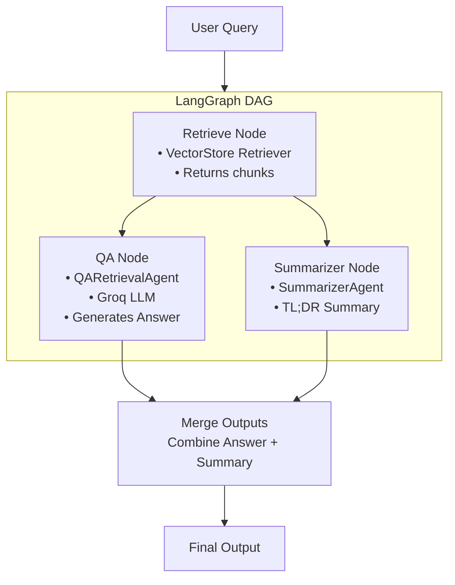

# 🚀 Multi-Agent RAG (LangGraph Powered)

[]()
[]()
[]()
[]()
[]()

A highly modular **Retrieval-Augmented Generation** system built on:
- **LangGraph** for multi-step orchestration  
- **Chroma / FAISS** for semantic retrieval  
- **Groq-powered agents** for QA + summarization  
- **Document ingestion & chunking** for accurate context retrieval  

---

# 📐 System Architecture

## 🔹 LangGraph Multi-Agent Workflow (Mermaid)



---

# 📦 Project Structure

```
multi-agent-rag/
├── src/
│   ├── ingest.py           → Document loading & chunking
│   ├── retriever.py        → VectorStore builder (Chroma/FAISS)
│   ├── agents/
│   │     ├── qa_agent.py   → QARetrievalAgent (Groq)
│   │     └── summarizer_agent.py
│   ├── graph/
│   │     └── rag_graph.py  → LangGraph orchestration
│   ├── config.py           → Settings for embeddings, paths
│   └── main.py             → CLI Entry point
├── requirements.txt
└── README.md
```

---

# ⚙️ Installation

```bash
git clone https://github.com/pallavikailas/multi-agent-rag.git
cd multi-agent-rag
python3 -m venv .venv
source .venv/bin/activate
pip install -r requirements.txt
```

---

# ▶️ Usage

Run the query engine:

```bash
./.venv/bin/python -m src.main    
```

Example:

```
🔍 Enter your query: <enter your desired query>

--- Summary ---
<generated summary>

--- Answer ---
<generated answer>
```

---

# 🧠 Components

### 🔍 Retriever Node  
Uses Chroma or FAISS to surface relevant embeddings.

### 🧠 QA Node (Groq LLM)  
Answers based on retrieved texts using QARetrievalAgent.

### 📝 Summarizer Node  
Produces a concise TL;DR summary of retrieved documents.

### 🔄 LangGraph State Machine  
Combines outputs into a stable, deterministic multi-agent workflow.

---

# 🤝 Contributing

Pull requests welcome!  
Open issues for improvements or feature additions.

---

# 📜 License  
MIT License — free to use, modify, and distribute.

